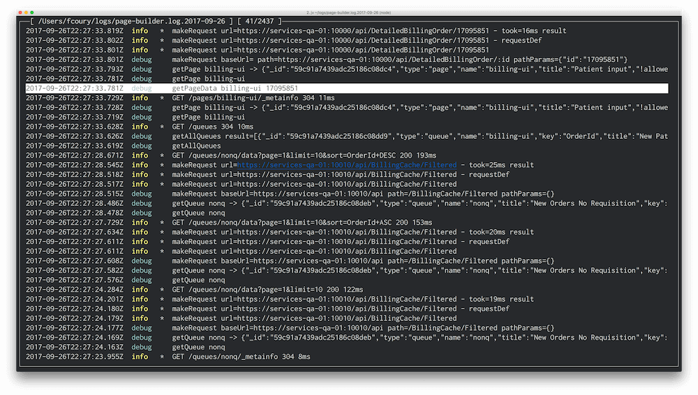
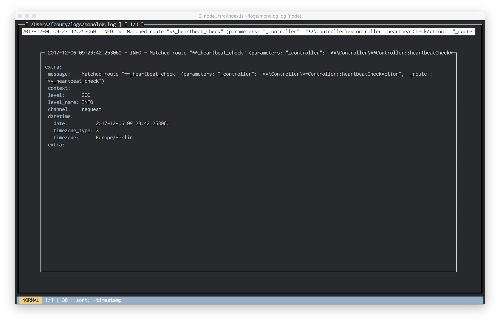
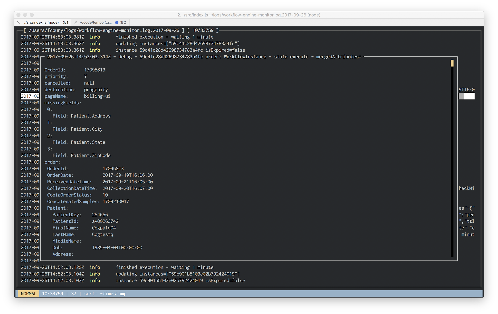
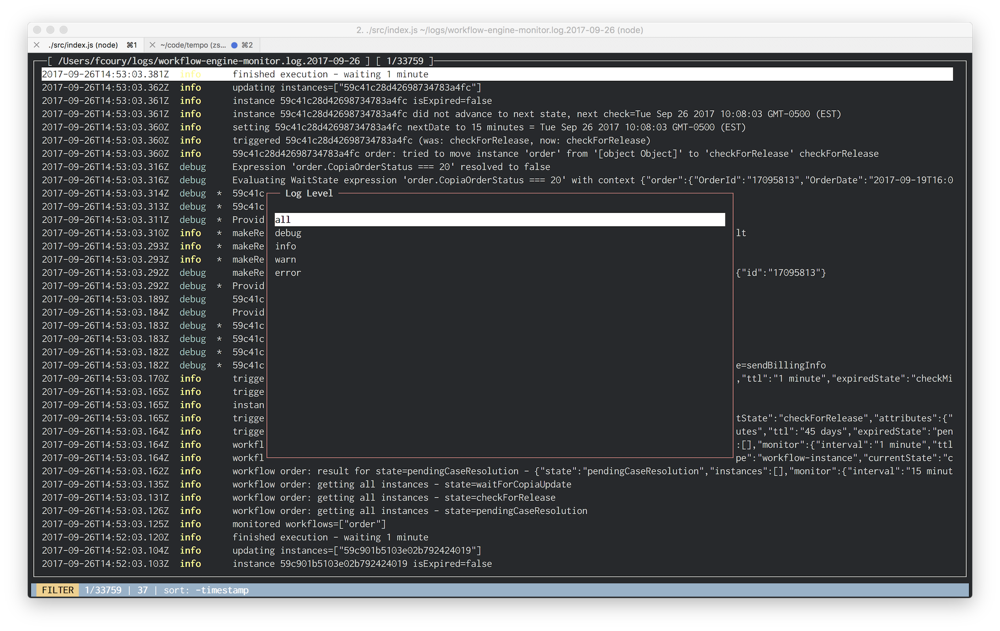

# json-log-viewer

[](https://badge.fury.io/js/json-log-viewer)

> Powerful terminal based viewer for JSON logs using ncurses.



**json-log-viewer** is a feature intensive viewer and analyze tool for JSON logs created by libraries like [https://github.com/winstonjs/winston](winston).

Features:

- completely operated by hotkeys
- powerful command line arguments
- sort by timestamp, level or message
- filter by any field or metadata
- search

Hotkeys:

- `arrows` and `page up/down` to move
- `/` to search
- `n` to search again
- `s` to sort
- `f` to filter
- `l` to filter by level
- `g` to go to line
- `0` to go to first line
- `$` to go to last line
- `q` to quit

## Install

```bash
npm install --global json-log-viewer
```

## Usage

```bash
jv application.log.2017-01-01 --sort timestamp
```

### Configuration

The default expected log format include fields `timestamp`, `level` and `message`. If the log file you're trying to parse doesn't include those fields, you can create a config file on your HOME path called `.json-log-viewer`.

For example, if your log lines look like this:

```json
{
  "message":
    "Matched route \"**_heartbeat_check\" (parameters: \"_controller\": \"**\\Controller\\**Controller::heartbeatCheckAction\", \"_route\": \"**_heartbeat_check\")",
  "context": [],
  "level": 200,
  "level_name": "INFO",
  "channel": "request",
  "datetime": {
    "date": "2017-12-06 09:23:42.253060",
    "timezone_type": 3,
    "timezone": "Europe/Berlin"
  },
  "extra": []
}
```

You can create a mapping configuration like this:

```ini
[transform]
level=level_name
timestamp=datetime.date
message=message
extra=$
```

This way the messages will properly be displayed. The `$` has a special meaning: it tells the the old object should be included on the `extra` key on the resulting JSON. The result will look like this:



## Screenshots

__Details view__



__Filters__


__Log level selection__



## License

[MIT](http://vjpr.mit-license.org)
